  
    
  

---

## 👨‍💻 Sobre Mim

<blockquote align="center">
  <h3>⚡ Engenheiro de Software Pleno</h3>
  
Desenvolvimento Full Stack, IA Aplicada & Engenharia de Compiladores

</blockquote>

Sou **Engenheiro de Software Pleno** residente em **Tatuí, SP**, integrando a equipe de engenharia da **Casa Publicadora Brasileira**. Possuo graduação em **Análise e Desenvolvimento de Sistemas** (Universidade Cruzeiro do Sul) e Pós-Graduação em **Engenharia de IA Aplicada** (UNIPDS/Anhanguera). Atuo no desenvolvimento Full Stack, modernização de sistemas legados enterprise, arquitetura de software e criação de ferramentas autônomas baseadas em IA.

- 🧠 **Engenharia de Software Core:** Modernização de sistemas legados, construção de novas aplicações de ponta a ponta, Clean Architecture, DDD e boas práticas de desenvolvimento em **Go**, **TypeScript** e **Python**.
- 🤖 **Sistemas de IA & Agentes Autônomos:** Contribuidor e adaptador do **OpenClaude**—agente de código CLI open-source multi-provedor customizado para fluxos empresariais e integração com LLMs (OpenAI, Gemini, DeepSeek, Ollama).
- ⚡ **Engenharia de Compiladores e Linguagens:** Criador do **Harpia**, uma linguagem de programação reativa e runtime de alta performance desenvolvida nativamente em Go.
- 🌐 **Visão de Engenharia de Produto:** Atuação integral na gestão e arquitetura de software, desde modelagem de banco de dados e APIs até interfaces web e sincronização offline.

**🎯 Aberto a:** Desafios em Engenharia de Software, Arquitetura de Aplicações, Engenharia de IA Aplicada e Colaborações em Projetos Open-Source.

---

## 🛠️ Tecnologias & Ferramentas

---

## 🤖 Especialidade em IA & Machine Learning

| Domínio                                    |  Proficiência  | Detalhes Técnicos                                                                                    |
| :------------------------------------------ | :-------------: | :---------------------------------------------------------------------------------------------------- |
| **Frameworks de Agentes & Tool Use**  |  `Avançado`  | Chamada de ferramentas, integração com protocolo MCP, automação CLI, orquestração de subagentes |
| **Integração de Provedores de LLM** |  `Avançado`  | OpenAI, Gemini 1.5/2.0, DeepSeek, Claude, Ollama, proxies compatíveis com OpenAI                     |
| **Engenharia de IA Aplicada**         | `Proficiente` | Arquitetura de soluções com IA, RAG, técnicas de otimização de contextos e prompts estruturados  |
| **Engenharia de Prompt & Fluxos**     | `Proficiente` | Chain-of-Thought, padrões de raciocínio ReAct, validação de dados em esquema JSON                 |
| **Implantação de Modelos Locais**   |  `Prático`  | Ollama, otimização de execução local, utilização de modelos quantizados GGUF                    |

---

## 🚀 Projetos em Destaque

<b>🤖 OpenClaude — Agente de Código Open-Source Adaptado</b>

 

**Descrição:** O OpenClaude é uma CLI para automação de código e execução multi-modelo com suporte a mais de 200 modelos (OpenAI, Ollama, DeepSeek e Gemini), adaptada para otimizar os fluxos de desenvolvimento da empresa.

| Métrica               | Detalhes                                                                                    |
| :--------------------- | :------------------------------------------------------------------------------------------ |
| **Stack**        | TypeScript, Node.js, APIs de Function Calling de LLMs, Protocolo MCP                        |
| **Escala**       | Suporte multi-modelo e execução em ambiente de desenvolvimento local                      |
| **Performance**  | Processamento assíncrono em fluxo contínuo para suporte imediato ao desenvolvedor         |
| **Segurança**   | Armazenamento seguro de tokens e execução de comandos isolada                             |
| **Impacto**      | Aumento substancial de produtividade na automação de refatorações e tarefas recorrentes |
| **Repositório** | [mat-dgruber/openclaude](https://github.com/mat-dgruber/openclaude)                          |

**Visão Geral Profissional:** Atuação na adaptação e customização da aplicação CLI para integração com ecossistemas de trabalho locais e suporte a chamadas de ferramentas.

<b>⚡ Harpia — Linguagem de Programação Reativa de Alta Performance</b>

 

**Descrição:** A Harpia é uma linguagem de programação reativa full stack orientada aos princípios de Clean Architecture e Domain-Driven Design (DDD), desenvolvida com sintaxe nativa em português brasileiro.

| Métrica               | Detalhes                                                                     |
| :--------------------- | :--------------------------------------------------------------------------- |
| **Stack**        | Go, Design de Compiladores, Parsers AST, Analisadores Léxicos               |
| **Escala**       | Gramática completa, avaliação de AST e suporte a compilação cruzada     |
| **Performance**  | Execução de AST em milissegundos via tempo de execução concorrente de Go |
| **Segurança**   | Espaço de memória isolado e checagem estática de tipos                    |
| **Impacto**      | Estudo e implementação de arquiteturas reativas de alta performance        |
| **Repositório** | [mat-dgruber/Harpia](https://github.com/mat-dgruber/Harpia)                   |

**Visão Geral Profissional:** Construção completa do analisador léxico, parser de descendência recursiva, avaliador de Árvore de Sintaxe Abstrata (AST) e ambiente de execução nativo em Go.

<b>📖 Lamed — Plataforma Educacional & Sincronização Offline</b>

 

**Descrição:** Plataforma educacional enterprise com sincronização em nuvem, ingestão automatizada de vídeos/áudios do YouTube e publicação de pacotes de conteúdo offline para uso missionário.

| Métrica               | Detalhes                                                                    |
| :--------------------- | :-------------------------------------------------------------------------- |
| **Stack**        | Python (FastAPI), Angular, TypeScript, PostgreSQL, Cloud Storage            |
| **Escala**       | Distribuição multi-tenant de pacotes offline e motor de sincronização   |
| **Performance**  | Processamento assíncrono em segundo plano com agendamentos automáticos    |
| **Segurança**   | Autenticação OAuth2, RBAC por JWT e validação criptográfica de pacotes |
| **Impacto**      | Suporte a milhares de usuários em áreas com conectividade limitada        |
| **Repositório** | [mat-dgruber/Lamed](https://github.com/mat-dgruber/Lamed)                    |

**Visão Geral Profissional:** Engenharia de serviços backend para automação de mídia, trabalhadores em segundo plano e interface web responsiva para distribuição de materiais.

<b>📊 CCAT-monFinTrack — Sistema de Gestão Financeira & Controle</b>

 

**Descrição:** Aplicação completa para acompanhamento, gestão de movimentações e controle financeiro construída com arquitetura moderna e interface intuitiva.

| Métrica               | Detalhes                                                                       |
| :--------------------- | :----------------------------------------------------------------------------- |
| **Stack**        | TypeScript, Angular, HTML5, CSS3, REST APIs                                    |
| **Escala**       | Gestão de dados financeiros estruturados com componentes reativos             |
| **Performance**  | Carregamento otimizado de telas e gerenciamento de estado eficiente            |
| **Segurança**   | Tratamento seguro de requisições e validação estrita de formulários       |
| **Impacto**      | Organização e controle transparente de indicadores financeiros               |
| **Repositório** | [mat-dgruber/CCAT-monFinTrack](https://github.com/mat-dgruber/CCAT-monFinTrack) |

**Visão Geral Profissional:** Desenvolvimento do frontend reativo em Angular, estruturação de fluxos de dados e telas de acompanhamento de movimentações.

---

## 💼 Experiência Profissional

### **Engenheiro de Software Pleno** — Casa Publicadora Brasileira (CPB)

`Fev 2026 — Presente` • _Brasil_

- Atuação direta na engenharia e programação de software, focando em desenvolvimento Full Stack e modernização de sistemas legados.
- Construção de novas aplicações do zero, utilizando **Go**, **TypeScript** e **Python**.
- Gestão de projetos e arquitetura de software, aplicando boas práticas de modelagem e padrões de projeto para soluções escaláveis.

### **Analista de Sistemas Júnior** — Casa Publicadora Brasileira (CPB)

`Dez 2024 — Fev 2026` • _Brasil_

- Suporte especializado a sistemas de ERP, pontos de venda (PDV) e integrações para mais de 20 filiais espalhadas pelo Brasil.
- Desenvolvimento e manutenção de banco de dados relacionais (escrita de scripts SQL, updates e procedures de alta complexidade).
- Prestação de suporte contínuo a funcionários e filiais e início da transição para engenharia de software ativa.

### **Assistente de Informática** — Casa Publicadora Brasileira (CPB)

`Ago 2023 — Dez 2024` • _Brasil_

- Suporte geral de infraestrutura, hardware e software; gestão de servidores e sistemas operacionais.
- Resolução de problemas lógicos, suporte técnico presencial e remoto, e gestão interpessoal de chamados.

### **Estagiário de Informática** — Casa Publicadora Brasileira (CPB)

`Jan 2023 — Ago 2023` • _Brasil_

- Apoio às rotinas da equipe de TI, manutenção de equipamentos e aprendizado prático da infraestrutura corporativa.

`Habilidades:` Go • TypeScript • Python • Angular • SQL / Banco de Dados • Docker • Suporte de Sistemas • Arquitetura de Software

---

## 🎓 Formação Acadêmica & Certificações

 

  
  

---

## 🎯 Foco Atual

- 📘 **Aprendendo:** Engenharia Avançada de Agentes de IA & Frameworks RAG | Teoria de Compiladores & Linguagens Reativas | Padrões de Arquitetura de Software Nativos em Nuvem
- 🛠️ **Construindo:** Adaptação do OpenClaude v2.0 com Suporte a MCP | Ecossistema & Evolução da Linguagem Harpia
- 🔬 **Explorando:** Aplicação Prática de Modelos LLM Locais em Processos Enterprise | Interoperabilidade entre Go e TypeScript para Alta Performance
- 🤝 **Aberto a:** Projetos e Desafios em Engenharia de Software Pleno | Inovações em IA Aplicada e Desenvolvimento Open Source

---

## 📬 Vamos nos Conectar

  
  
  

---

  "Elegância em engenharia não é quando não há mais nada a acrescentar, mas quando não há mais nada a retirar."
    
  

